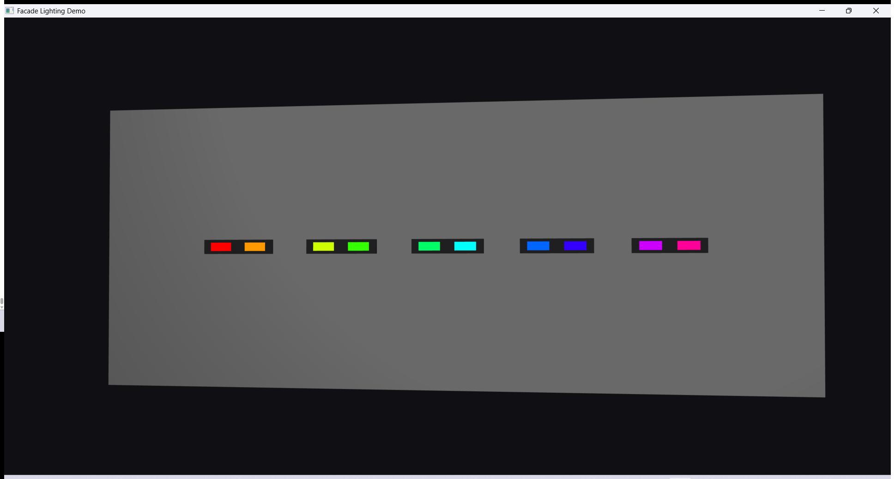

# Facade Lighting Demo

A small WPF app that draws the light fixtures of a building facade with
[Ab4d.SharpEngine](https://www.ab4d.com/SharpEngine.aspx).

The real-world target is a facade with 20,000 to 50,000 fixtures and around 5 million pixels.
I'm building towards that in small steps and writing down what I learn here.



## Run it

You need Windows and the .NET 10 SDK.

```
dotnet run
```

Left mouse drag rotates the camera, Ctrl + drag moves it, the wheel zooms.

## How it works

A facade has fixtures, and every fixture has a few pixels. A pixel is one small light with its own color.

Making one scene object per pixel would be far too slow with millions of them. So the pixels are
drawn with instancing: the engine gets one quad mesh plus a list of positions and colors, and draws
the whole list in one go. In SharpEngine that is an `InstancedMeshNode`.

Pixels are flat quads instead of spheres because a quad is only 2 triangles, and from a distance
a light looks like a flat dot anyway. They are drawn in a solid color with no shading, so they
look like they glow.

## Real light vs fake light

The pixels don't actually light anything up. They are colored quads, and the wall next to a red
pixel doesn't turn red.

I thought about making them real lights, but no engine can calculate millions of light sources in
real time. And for a preview it isn't needed: if I control the color of every pixel, I'm already
showing what the facade will look like. If it needs to feel more like light, a glow around the
pixels can be faked cheaply later.

This is an assumption on my side, and something I'd like to discuss.

## Performance

Measured on my laptop: RTX 2060 6GB, Intel Core i7-10750H 2.60GHz, 144 Hz screen.


| Fixtures | Pixels per fixture | Pixels    | Avg frame time | FPS    |
| -------- | ------------------ | --------- | -------------- | ------ |
| 5        | 2                  | 10        | 2.43 ms        | 144    |
| 500      | 4                  | 2,000     | 2.43 ms        | 144    |
| 5,000    | 8                  | 40,000    | 2,49 ms        | 144    |
| 20,000   | 100                | 2,000,000 | 4,69 ms        | 144    |
| 50,000   | 100                | 5,000,000 | 9,65 ms        | 100,93 |


FPS can't go above 144 because of the screen, so frame time is the number to watch as the
fixture count grows.

### With animated colors

Every frame each pixel asks the current effect for its color, and the whole pixel array is sent
to the graphics card again. "Color update" is the time that takes. The engine's frame time
doesn't include it, so I measure it separately.


| Fixtures | Pixels    | Effect  | Color update | Avg frame time | FPS |
| -------- | --------- | ------- | ------------ | -------------- | --- |
| 5        | 10        | Wipe    | 0.02 ms      | 2.25 ms        | 144 |
| 500      | 2,000     | Wipe    | 0.08 ms      | 2.52 ms        | 140 |
| 5,000    | 40,000    | Wipe    | 2.02 ms      | 1.11 ms        | 144 |
| 20,000   | 2,000,000 | Wipe    | 60.2 ms      | 7.48 ms        | 14  |
| 50,000   | 5,000,000 | Wipe    | 204.6 ms     | 14.74 ms       | 5   |
| 20,000   | 2,000,000 | Rainbow | 91.4 ms      | 11.58 ms       | 9   |
| 50,000   | 5,000,000 | Rainbow | 247.9 ms     | 18.64 ms       | 4   |


Drawing 5 million pixels is fine (about 100 FPS static), but changing them every frame isn't.
Up to 40,000 pixels animation is basically free. At millions of pixels the color update takes
far longer than the drawing itself, and FPS drops to single digits.

This is the simple version on purpose: one C# loop over every pixel, then re-sending the whole
array, including positions that never change. Each pixel entry is 80 bytes but only 16 of them
are the color. Next step is finding out which part is slow and fixing that.

### Where the color update time goes

I split the color update in two: the C# loop that works out every pixel's color, and sending the
array to the graphics card (`UpdateInstancesData`).


| Pixels    | Effect  | Colors loop | Send to GPU | Total    |
| --------- | ------- | ----------- | ----------- | -------- |
| 40,000    | Wipe    | 0.75 ms     | 1.34 ms     | 2.09 ms  |
| 2,000,000 | Wipe    | 26.5 ms     | 32.7 ms     | 59.2 ms  |
| 2,000,000 | Rainbow | 48.4 ms     | 32.7 ms     | 81.1 ms  |
| 5,000,000 | Wipe    | 64.6 ms     | 135.2 ms    | 199.9 ms |
| 5,000,000 | Rainbow | 131.5 ms    | 141.2 ms    | 272.7 ms |


Both parts are slow at millions of pixels, so both need fixing. Sending is the bigger one and
doesn't depend on the effect, it's just the size of the array. The loop depends on how much math
the effect does.

### How often colors need to change

Right now the colors are recalculated on every drawn frame, so up to 144 times a second on my
screen. Before picking a lower rate I looked into DMX, the protocol real fixtures are controlled
with. A full DMX universe (all 512 channels) refreshes at about 44 Hz. With fewer channels it can
go faster, but a pixel facade packs its universes full (one RGB pixel is 3 channels, so about 170
pixels per universe), so 44 Hz is the realistic number here. Updating the preview's colors faster than ~44 times a second doesn't show
anything the building would show, so that's the rate I'm going for.

## Progress

**Stage 1 (done):** 5 fixtures, 2 pixels each, nothing moving. The whole facade is 2 scene nodes:
one for the fixture housings and one for the pixels.

**Stats overlay (done):** fixture count, frame time and FPS in the top left corner. Added before
scaling up, so I can see what each change costs.

**Scaling (done):** fixtures are laid out in a grid, and the counts can be passed on the command
line: `dotnet run -c Release -- 50000 100` (fixtures, pixels per fixture).

**Effects (done):** pixel colors come from an effect. An effect only answers "what color is the
pixel at this spot on the facade, at this time?", where the spot goes from 0 to 1 across the
facade. That way the same effect works on any facade size, and video can plug in the same way
later. Two effects so far, Wipe and Rainbow.

Keys: `E` next effect, left / right speed, up / down brightness, space camera rotation.

Next up:

- make the color update fast enough for millions of pixels
- click a fixture to select it
- add fixtures at runtime

