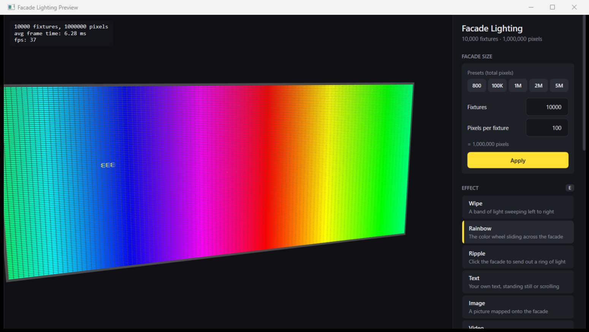
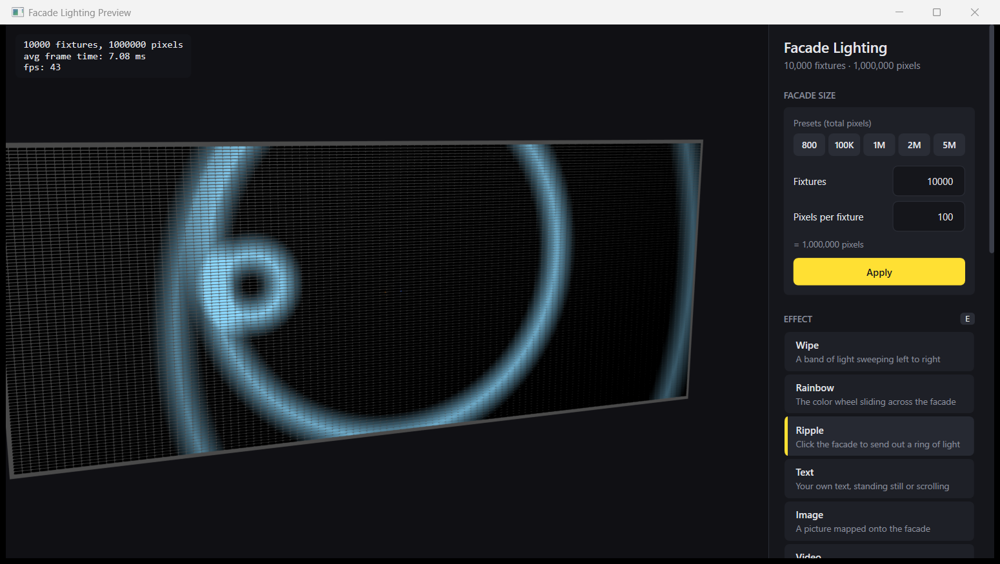

# Facade Lighting Demo

A WPF app that shows a building facade full of light fixtures, built with
[Ab4d.SharpEngine](https://www.ab4d.com/SharpEngine.aspx). Every fixture has its own pixels, and
every pixel can have its own color. It goes up to 50,000 fixtures and 5 million pixels, with live
effects, images and video on top.

Videos:
- [3 minute walkthrough](https://drive.google.com/file/d/1CqjlN0QWM9jB80rAJCF-iwrR6mlf81wQ/view?usp=sharing)
- [Image and video on the facade](https://drive.google.com/file/d/14RaOHoLWfuCHuoGHAPur6RlOgw0KXbTQ/view?usp=sharing)

## Try it

Download `FacadeLightingDemo.exe` from the [latest release](https://github.com/Efe-Oral/Traxon-SharpEngine-Demo/releases/latest)
and double-click it. Nothing to install.

You need Windows 10/11 and a graphics card with Vulkan support (most cards from the last few years).
Windows will probably say "Windows protected your PC" because the file isn't signed. Click
"More info" and then "Run anyway".

It uses a SharpEngine trial license, so it works until November 30, 2026.

If you have the .NET 10 SDK you can also run it from the code: `dotnet run -c Release`.

## What you can do

- **Change the facade size** with the presets in the panel (800, 100K, 1M, 2M or 5M pixels), or type
  your own number of fixtures and pixels per fixture.
- **Pick an effect:** Wipe, Rainbow, Ripple (click the facade to send out rings), Text (type your
  own, static or scrolling), Image, Video and Blackout.
- **Show an image or a video** on the facade. Fit or fill, and images can scroll too. 720p or 1080p
  videos work best.
- **Change speed, brightness and color** while it runs. The color wheel recolors the effect, or
  paints the selected fixtures if you have any.
- **Select fixtures:** hover to see a fixture's number, click to select, drag a box to select a
  group. **Identify** makes the selected fixtures blink, like "locate" on a lighting desk.

## Controls

| Input | What it does |
| --- | --- |
| Click / drag | Select fixtures (box) |
| Ctrl + click / drag | Add to the selection |
| Right drag | Rotate the camera |
| Hold wheel + drag | Move the camera |
| Scroll | Zoom |
| `E` | Next effect |
| ← → / ↑ ↓ | Speed / brightness |
| `I` / `Esc` | Identify / clear the selection |
| Space | Auto rotate the camera |

Everything is also in the panel on the right.

## How it works

A facade is a list of fixtures, and every fixture owns a few pixels. All the pixel colors live in
one big list.

Making a separate 3D object for every pixel would be way too slow with millions of them. So the
fixture housings are drawn with instancing (one box shape, drawn thousands of times in one go), and
the pixels are one `PixelsNode`, which draws a small dot for every pixel.

The effects all work the same way. Each one only answers: "what color is the pixel at this spot on
the facade, at this time?" That's why the same effect works on any facade size. Images and video
use the same idea: every pixel takes the color of the picture at its spot.

## Some decisions along the way

**Real light vs fake light.** The pixels don't actually light up the wall around them. No engine
can calculate millions of real light sources in real time, and for a preview I don't think it's
needed: if I control the color of every pixel, I'm already showing what the facade will look like.

**Updating colors 44 times a second.** Before picking a rate I looked into DMX, which real fixtures
are controlled with. A full DMX universe (512 channels) refreshes at about 44 Hz. It can go faster
with fewer channels, but a pixel facade fills its universes (an RGB pixel is 3 channels, so about
170 pixels per universe). The real lights never change faster than that, so the preview doesn't
need to either.

**Dots, quads or one big texture.** The pixels started as small flat squares (quads), then became
dots to make color updates much cheaper. I asked the SharpEngine developer about it and he suggested
drawing everything as one big texture instead. I tried two versions of that. They made the graphics
card's job about 3 times lighter, but the overall FPS stayed about the same, because most of the
time goes into working out the colors, not drawing them. They also didn't look as good: one version
turned the facade into a flat TV screen and the other looked dim from a distance. So I stayed with
dots.

**Video with the built-in Windows player.** Video uses the video player that comes with WPF, so the
app stays one small .exe with nothing extra. It plays the video in the background and I grab its
current frame up to 30 times a second. That's quick for 720p videos (about 6 ms per frame) but much
slower for 4K (about 25 ms), which is why lower resolutions are recommended. A facade has far fewer
lights than a 4K video has pixels anyway.

## Performance

Measured on my laptop: RTX 2060 6GB, Intel Core i7-10750H, 144 Hz screen.

Just drawing the facade (no animation) is easy, even at 5 million pixels:

| Pixels | Frame time | FPS |
| --- | --- | --- |
| 2,000 | 2.4 ms | 144 |
| 40,000 | 2.5 ms | 144 |
| 2,000,000 | 4.7 ms | 144 |
| 5,000,000 | 9.7 ms | 101 |

FPS can't go above 144 because of the screen.

Changing every pixel's color all the time is the hard part. The first simple version dropped to
5 FPS at 5 million pixels. I measured where the time went and fixed it in three steps:

1. Work out the colors on all CPU cores at once.
2. Only update colors 44 times a second (the DMX rate above).
3. Only send the colors to the graphics card, not the positions (by switching to `PixelsNode`).

| | 2M pixels, animated | 5M pixels, animated |
| --- | --- | --- |
| Simple version | 15 fps | 5 fps |
| After the 3 fixes | 37 fps | 14 fps |

Up to about 2 million pixels it now animates smoothly. At 5 million it's usable but not smooth.
Video at 1 million pixels runs at about 30 FPS.

## What I'd do next

- **Faster color updates for 5 million pixels.** Work out the effects on the graphics card itself
  instead of the CPU. The SharpEngine developer is also adding faster ways to update colors.
- **2D tile fixtures.** Right now every fixture is a horizontal bar, so the facade has lots of pixels
  across but few rows. Square tiles with a grid of pixels would make images and video much sharper.
- **Adding fixtures while it runs,** instead of only picking a facade size.
